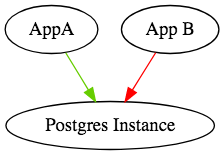
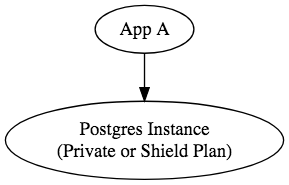
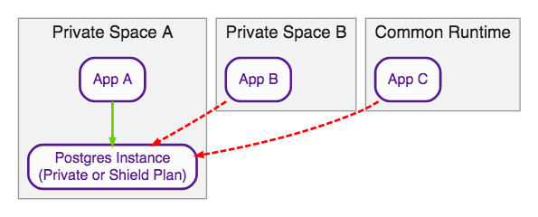
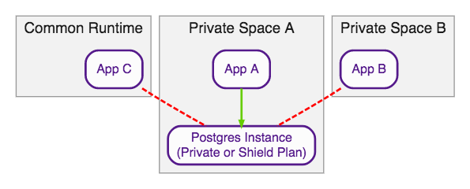
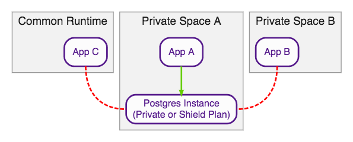

**Graphviz** is like markdown, for diagrams.

It's a tool that can transform text input into a "directed graph" output, which is nodes pointing to other nodes. You can use it for architecture diagrams, DB diagrams, documentation for users, etc.


# Table of Contents

- [Intro](#intro)
  - [Goals](#goals)
  - [Two-Pane Graphviz Editors](#two-pane-graphviz-editors)
- [Tutorial](#tutorial)
  - [Basic Structure](#basic-structure)
  - [Colors & Quotes](#colors--quotes)
  - [More Edge Properties](#more-edge-properties)
  - [Multi-line Text](#multi-line-text)
  - [Subgraph Boxes](#subgraph-boxes)
  - [Global Styles](#global-styles)
  - [Node Ordering](#node-ordering)
  - [Compass Directions](#compass-directions)
- [Keeping Track of Diagrams](#keeping-track-of-diagrams)

# Graphviz Tutorial

This is a step by step tutorial, introducing commonly used features of graphviz one at a time.

## Intro
### Goals

By the end, we'll produce this diagram.


You'll learn about:
- nodes & connections
- how to style connections (nodes are similar)
- how to do multiline text in nodes
- grouping nodes using subgraphs
- applying styles globally
- ordering affects how it's drawn
- specify where on the node the connection attachmes


### Two-Pane Graphviz Editors

You'll want to use a tool with a two-pane layout - the left side is the source text, the right side is the image output.

Online Tools

- For just you working on it, use <http://graphviz.it> (shown above; it has more features)
- For realtime collaboration, use <http://graphvizrepl.com>

Text Editor

- Try this [atom plugin](https://github.com/sverweij/atom-graphviz-preview-plus)

You might also like a tool to help you paste images in a markdown-friendly format like [this atom one](https://github.com/tlnagy/atom-markdown-image-assistant).


## Tutorial
The reference page I end up on most is the general [`attrs` one](https://www.graphviz.org/doc/info/attrs.html).

### Basic Structure
Graphs are wrapped in `digraph G {}` - G is an arbitrary name. The way we use graphviz, we can't/won't do graphs with separate names.

A graphviz **graph** has **nodes** connected by **edges** (I'll use the more colloquial term *connections*). Here is a simple example, with (optional) text labels on these the connections.

```dot
digraph G {
    "App A" -> "Postgres Instance" [label="yes"]
    "App B" -> "Postgres Instance" [label="no"]
}
```


### Colors & Quotes
For colors, you can use the [x11 palette](https://www.graphviz.org/doc/info/colors.html), or hex colors like `"#FF0000"`. Make sure to always use **double quotes** in graphviz. You will get errors with single quotes sometimes - like with hex colors. Sometimes you can get away with not using quotes at all, and that's really okay to do in graphviz. You'll know quickly whether it compiles or not.

```dot
digraph G {
    AppA -> "Postgres Instance" [color=chartreuse3]
    "App B" -> "Postgres Instance" [color="#FF0000"]
}
```



### More Edge Properties

You can change many other properties of edges (connections), too!

```dot
digraph G {
    "App A" -> "Postgres Instance" [arrowhead=crow, arrowtail=crow, dir=both]
    "App B" -> "Postgres Instance" [color=red, style=dashed, dir=none]
}
```


### Multi-line Text

If you want to have more than one line of text in a node, you can manually put a newline line break using `\n`.

```dot
digraph G {
    "App A" -> "Postgres Instance\n(Private or Shield Plan)"
}
```



### Subgraph Boxes

You can draw a box around a group of nodes, and label it. This is a `subgraph`. The biggest gotcha here is that subgraph names must start with `cluster`. You label this using `label="My Subgraph Box Title"`. You can make the labels go to the bottom using `labelloc=b`, or move it explicitly to the top using `labelloc=t`.

 I recommend declaring nodes within the subgraph (one node per line) - not making connections within in a subgraph. Define the connections after and outside the subgraph definitions.

```dot
digraph G {
    subgraph cluster1 {
      label="Private Space A"
      "App A"
      "Postgres Instance\n(Private or Shield Plan)"
    }
    subgraph cluster2 {
      label="Private Space B"
      labelloc=b
      "App B"

    }
    "App A" -> "Postgres Instance\n(Private or Shield Plan)" [color=chartreuse3]
    "App B" -> "Postgres Instance\n(Private or Shield Plan)" [color=red, style=dashed]
}
```


### Global Styles

If you want to style your graphs in generally the same way, you can declare some baseline attributes at the top. Any attribute you set on a node or edge below will override, like CSS.

Here's an example with Heroku's base styles. Also fleshing the example out more with another node.

```dot
digraph G {
    ///// start Heroku styles
    graph [fontname="helvetica",fontsize=14,splines=true,pad=0.1,compound=true,color="grey60",fontcolor="grey10",fillcolor=grey95,style="filled"];
    node [fontname="helvetica",fontsize=12,color=purple4,shape=box,style="rounded, filled",fontcolor=purple4,fillcolor=grey99,penwidth=2];
    edge [fontname="helvetica",color=grey35,fontcolor=black,arrowhead="normal",penwidth=2,arrowsize=0.5];
    ///// end Heroku styles

    subgraph cluster1 {
      label="Private Space A"
      "App A"
      "Postgres Instance\n(Private or Shield Plan)"
    }
    subgraph cluster2 {
      label="Private Space B"
      "App B"
    }
    subgraph cluster3 {
      label="Common Runtime"
      "App C"
    }
    "App A" -> "Postgres Instance\n(Private or Shield Plan)" [color=chartreuse3]
    "App B" -> "Postgres Instance\n(Private or Shield Plan)" [color=red, style=dashed]
    "App C" -> "Postgres Instance\n(Private or Shield Plan)" [color=red, style=dashed]
}
```




### Node Ordering
ah! but sometimes ordering affects how it's drawn. If we want this to look more balanced, we can move "App C" up the file, and it'll be drawn sooner.

Ordering affects how it's drawn in this case - but you can't always control the order things are drawn in. This limitation can be valuable in some ways, it helps you focus on the content more than presentation. This tool is not the ideal one for picture-perfect diagrams, but it's great at making good-enough looking, maintainable diagrams.

```
digraph G {
    ///// start Heroku styles
    graph [fontname="helvetica",fontsize=14,splines=true,pad=0.1,compound=true,color="grey60",fontcolor="grey10",fillcolor=grey95,style="filled"];
    node [fontname="helvetica",fontsize=12,color=purple4,shape=box,style="rounded, filled",fontcolor=purple4,fillcolor=grey99,penwidth=2];
    edge [fontname="helvetica",color=grey35,fontcolor=black,arrowhead="normal",penwidth=2,arrowsize=0.5];
    ///// end Heroku styles

    subgraph cluster3 {
      label="Common Runtime"
      "App C"
    }
    subgraph cluster1 {
      label="Private Space A"
      "App A"
      "Postgres Instance\n(Private or Shield Plan)"
    }
    subgraph cluster2 {
      label="Private Space B"
      "App B"
    }

    "App A" -> "Postgres Instance\n(Private or Shield Plan)" [color=chartreuse3]
    "App B" -> "Postgres Instance\n(Private or Shield Plan)" [color=red, style=dashed, dir=none]
    "App C" -> "Postgres Instance\n(Private or Shield Plan)" [color=red, style=dashed, dir=none]
}
```




### Compass Directions
Many advanced style properties don't work perfectly - the rounded borders we added earlier using Heroku's global styles made a small gap at the top part of the red dotted lines. If we hadn't rounded the edges it would be lining up perfectly.

This can look good though - we can push forward and adjust where it connects! We can use compass rose directions, such as North `:n` or Northwest `:nw`.

```dot
digraph G {
    ///// start Heroku styles
    graph [fontname="helvetica",fontsize=14,splines=true,pad=0.1,compound=true,color="grey60",fontcolor="grey10",fillcolor=grey95,style="filled"];
    node [fontname="helvetica",fontsize=12,color=purple4,shape=box,style="rounded, filled",fontcolor=purple4,fillcolor=grey99,penwidth=2];
    edge [fontname="helvetica",color=grey35,fontcolor=black,arrowhead="normal",penwidth=2,arrowsize=0.5];
    ///// end Heroku styles

    subgraph cluster3 {
      label="Common Runtime"
      "App C"
    }
    subgraph cluster1 {
      label="Private Space A"
      "App A"
      "Postgres Instance\n(Private or Shield Plan)"
    }
    subgraph cluster2 {
      label="Private Space B"
      "App B"
    }

    "App A" -> "Postgres Instance\n(Private or Shield Plan)" [color=chartreuse3]
    "App B":s -> "Postgres Instance\n(Private or Shield Plan)":e [color=red, style=dashed, dir=none]
    "App C":s -> "Postgres Instance\n(Private or Shield Plan)":w [color=red, style=dashed, dir=none]
}
```




## Keeping track of diagrams

You should keep track of your diagrams somewhere - I recommend in a github repo. Suggestion-instructions here in this [gist](https://caseywatts.com/graphviz).
